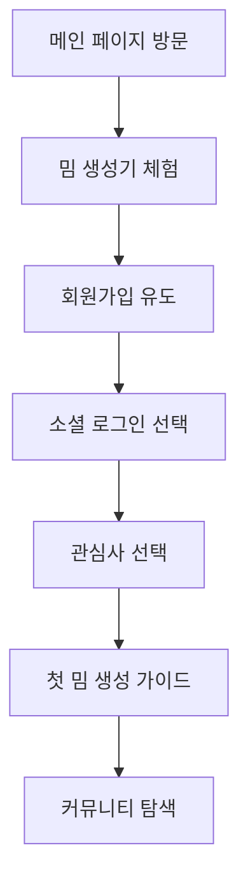
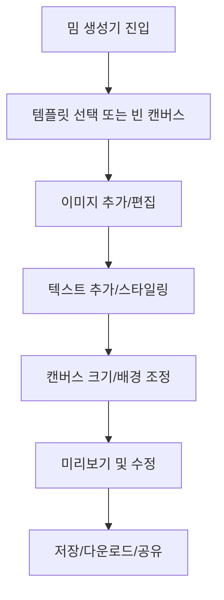

# 밈징(Memezing) 웹 기획서

---

## 📋 프로젝트 개요

### 🎯 프로젝트 명
**밈징(Memezing) - 한국 문화 특화 밈 생성 및 공유 플랫폼**

### 📅 기획일자
2025년 1월

### 🎨 프로젝트 비전
한국 문화와 트렌드에 특화된 직관적이고 재미있는 밈 생성 도구를 통해 누구나 쉽게 밈을 만들고 공유할 수 있는 소셜 플랫폼 구축

---

## 🎯 사업 목표 및 타겟 분석

### 📊 사업 목표
- **1차 목표**: 월 활성 사용자(MAU) 10만명 달성
- **2차 목표**: 일일 밈 생성량 1만개 달성
- **3차 목표**: 소셜미디어 바이럴 콘텐츠 생성 허브 구축

### 👥 주요 타겟 사용자
1. **메인 타겟 (20-30대)**
   - 소셜미디어 활성 사용자
   - 밈 문화에 친숙한 MZ세대
   - 간편한 콘텐츠 제작 도구를 선호

2. **서브 타겟 (10대 후반-40대)**
   - 암호화폐/투자 커뮤니티 참여자
   - 온라인 커뮤니티 활동자
   - 개인 브랜딩에 관심있는 크리에이터

---

## 🗺️ 사이트맵 구조

```
🏠 메인 홈페이지 (/)
├── 🎨 밈 생성기 (/meme-generator)
│   ├── 📱 모바일 최적화 버전 (/meme-generator/mobile)
│   └── 🖼️ 템플릿 갤러리
├── 👥 커뮤니티 (/community)
│   ├── 📝 게시물 상세 (/community/[id])
│   ├── ✍️ 업로드 (/community/upload)
│   └── 🔍 검색 및 필터링
├── 🔐 사용자 인증
│   ├── 🚪 로그인 (/auth/signin)
│   ├── 📝 회원가입 (/auth/signup)
│   └── 👤 프로필 (/profile)
├── 🎪 사용자 대시보드 (/dashboard)
├── 🚀 온보딩 (/onboarding)
├── 📚 컴포넌트 데모 (/components)
└── 🧪 테스트 페이지 (/test-components)
```

---

## 🎨 주요 기능 정의서

### 1️⃣ 핵심 기능: 고급 밈 생성기

#### 🖼️ 캔버스 시스템
- **반응형 캔버스**: 화면 크기에 따른 자동 적응
- **크기 조절**: 8가지 프리셋 + 커스텀 크기
  - 정사각형: 1:1 (500x500px)
  - 가로형: 16:9, 4:3, 3:2
  - 세로형: 9:16, 3:4, 2:3
  - 커스텀: 사용자 정의 크기
- **배경 설정**: 단색, 그라데이션, 투명 배경 지원

#### ✍️ 텍스트 편집 도구
- **고급 폰트 옵션**: 한글 웹폰트 지원
- **텍스트 스타일링**: 크기, 색상, 굵기, 기울임, 밑줄
- **텍스트 효과**: 그림자, 윤곽선, 그라데이션
- **실시간 미리보기**: 편집 중 즉시 반영

#### 🖼️ 이미지 관리
- **다중 이미지 레이어**: 무제한 이미지 추가
- **이미지 편집**: 크기 조절, 회전, 투명도 조절
- **템플릿 시스템**: 
  - ImgFlip API 연동 (실시간 인기 밈)
  - 밈코인 특화 템플릿
  - 사용자 업로드 템플릿

### 2️⃣ 사용자 시스템

#### 🔐 인증 시스템
- **하이브리드 인증**: NextAuth.js + Custom JWT
- **소셜 로그인**: Google, 카카오, 네이버
- **이메일 회원가입**: 이메일 인증 포함
- **테스트 계정**: 빠른 체험을 위한 데모 계정

#### 👤 프로필 관리
- **개인 정보 관리**: 이름, 이메일, 프로필 사진
- **작품 포트폴리오**: 생성한 밈 히스토리
- **활동 통계**: 좋아요, 공유수, 조회수

### 3️⃣ 커뮤니티 기능

#### 📱 소셜 기능
- **밈 공유**: 생성한 밈을 커뮤니티에 게시
- **상호작용**: 좋아요, 댓글, 공유
- **피드 시스템**: 인기순, 최신순, 추천 정렬
- **해시태그**: 카테고리별 분류 및 검색

#### 🔍 검색 및 발견
- **키워드 검색**: 제목, 태그, 사용자명
- **카테고리 필터**: 장르별, 인기도별 분류
- **트렌딩**: 실시간 인기 밈 추천

---

## 👤 사용자 시나리오 및 플로우

### 🚀 신규 사용자 온보딩 플로우



#### 🎯 상세 시나리오
1. **첫 방문 (0-30초)**
   - 메인 페이지에서 밈 생성기 버튼 노출
   - 로그인 없이 즉시 체험 가능
   - 간단한 밈 생성 데모 제공

2. **체험 단계 (30초-2분)**
   - 드래그앤드롭으로 이미지 추가
   - 텍스트 입력 및 스타일 적용
   - 실시간 프리뷰 확인

3. **전환 단계 (2-5분)**
   - 생성 완료 후 저장/공유 시점에서 회원가입 유도
   - 간편한 소셜 로그인 제공
   - 관심사 선택으로 개인화

### 🎨 밈 생성 사용자 플로우



#### 📱 모바일 최적화 플로우
- **터치 인터페이스**: 핀치 줌, 드래그 최적화
- **간소화된 UI**: 핵심 기능만 노출
- **세로형 레이아웃**: 모바일 화면 비율 고려
- **빠른 액션**: 원탭 저장, 즉시 공유

---

## ♿ 웹 접근성 및 사용성 설계

### 🎯 접근성 준수 사항

#### 🖱️ 키보드 내비게이션
- **Tab 순서**: 논리적 포커스 이동
- **단축키**: 주요 기능 키보드 접근
- **포커스 표시**: 명확한 시각적 피드백

#### 👁️ 시각적 접근성
- **색상 대비**: WCAG 2.1 AA 기준 준수
- **텍스트 크기**: 최소 16px, 확대 지원
- **대체 텍스트**: 모든 이미지에 alt 속성

#### 🔊 스크린 리더 지원
- **시맨틱 HTML**: 의미있는 마크업 구조
- **ARIA 라벨**: 동적 콘텐츠 접근성
- **역할 정의**: 명확한 컴포넌트 역할

### 🎨 사용성 설계 원칙

#### 📱 직관적 인터페이스
- **시각적 계층**: 중요도에 따른 UI 배치
- **일관된 디자인**: 통일된 컴포넌트 시스템
- **즉시 피드백**: 사용자 액션에 대한 실시간 반응

#### 🚀 성능 최적화
- **로딩 시간**: 3초 이내 초기 로딩
- **이미지 최적화**: WebP, lazy loading
- **번들 크기**: 페이지별 최적화된 번들

---

## 📱 반응형 웹 설계

### 🖥️ 브레이크포인트 정의

```css
/* 모바일 퍼스트 접근 */
mobile: 320px ~ 767px      /* 스마트폰 */
tablet: 768px ~ 1023px     /* 태블릿 */
desktop: 1024px ~ 1439px   /* 데스크톱 */
large: 1440px ~            /* 대형 모니터 */
```

### 📐 레이아웃 시스템

#### 📱 모바일 (320px-767px)
- **단일 컬럼**: 세로 스크롤 중심 레이아웃
- **풀 스크린**: 화면 공간 최대 활용
- **터치 친화적**: 44px 이상 버튼 크기
- **간소화된 네비게이션**: 햄버거 메뉴

#### 📟 태블릿 (768px-1023px)
- **2컬럼 레이아웃**: 사이드바 + 메인 콘텐츠
- **적응형 네비게이션**: 탭바 또는 사이드바
- **터치 + 마우스**: 하이브리드 인터랙션

#### 🖥️ 데스크톱 (1024px+)
- **3컬럼 레이아웃**: 사이드바 + 메인 + 위젯
- **호버 효과**: 마우스 인터랙션 최적화
- **키보드 단축키**: 파워 유저 지원

### 🎨 반응형 컴포넌트 설계

#### 🖼️ 밈 생성기 캔버스
- **모바일**: 전체 화면 캔버스, 하단 툴바
- **태블릿**: 좌측 툴바, 중앙 캔버스
- **데스크톱**: 좌측 툴바, 중앙 캔버스, 우측 프로퍼티

#### 📋 커뮤니티 피드
- **모바일**: 단일 컬럼 카드 리스트
- **태블릿**: 2컬럼 그리드
- **데스크톱**: 3-4컬럼 그리드, 사이드바

---

## 🎨 디자인 시스템

### 🌈 컬러 팔레트

```css
/* 브랜드 컬러 */
Primary: #FF6B47 (밝은 오렌지)
Secondary: #4ECDC4 (민트 그린)
Accent: #FFD93D (노란색)

/* 뉴트럴 컬러 */
Gray-50: #F9FAFB
Gray-100: #F3F4F6
Gray-900: #111827

/* 시스템 컬러 */
Success: #10B981
Warning: #F59E0B
Error: #EF4444
```

### 🔤 타이포그래피

```css
/* 한글 폰트 */
Primary: 'Pretendard', -apple-system, sans-serif
Heading: 'Black Han Sans', sans-serif (브랜드 헤딩)
Code: 'JetBrains Mono', monospace

/* 크기 시스템 */
text-xs: 12px
text-sm: 14px
text-base: 16px
text-lg: 18px
text-xl: 20px
text-2xl: 24px
```

### 🧩 컴포넌트 라이브러리

#### 🔘 버튼 시스템
- **Primary**: 메인 액션 (밝은 오렌지)
- **Secondary**: 서브 액션 (민트 그린)
- **Outline**: 보조 액션 (테두리)
- **Ghost**: 텍스트 버튼 (배경 없음)

#### 📝 폼 컨트롤
- **Input**: 텍스트 입력 필드
- **Select**: 드롭다운 선택 (색상 미리보기 지원)
- **Checkbox**: 체크박스 (커스텀 디자인)
- **RadioBox**: 라디오 버튼
- **RangeSlider**: 범위 슬라이더

---

## 🚀 기술 스택 및 아키텍처

### 💻 프론트엔드 기술 스택
- **Next.js 15.4.4**: App Router + SSR
- **TypeScript**: 타입 안전성
- **Tailwind CSS + Emotion**: 스타일링
- **Fabric.js**: 캔버스 편집 엔진
- **Framer Motion**: 애니메이션
- **React Query**: 서버 상태 관리
- **Zustand**: 클라이언트 상태 관리

### 🔧 백엔드 및 인프라
- **Next.js API Routes**: 서버리스 API
- **NextAuth.js**: 인증 시스템
- **Prisma**: ORM 및 데이터베이스 관리
- **PostgreSQL**: 관계형 데이터베이스
- **Cloudinary**: 이미지 저장 및 최적화
- **Vercel**: 배포 플랫폼

### 🏗️ 아키텍처 패턴

#### 📁 폴더 구조
```
src/
├── app/                 # Next.js App Router
│   ├── (pages)/        # 페이지 라우트
│   └── api/            # API 엔드포인트
├── components/         # 재사용 컴포넌트
│   ├── ui/            # 기본 UI 컴포넌트
│   ├── sections/      # 페이지 섹션
│   └── common/        # 공통 컴포넌트
├── lib/               # 유틸리티 함수
├── hooks/             # 커스텀 훅
├── store/             # 상태 관리
└── types/             # TypeScript 타입
```

---

## 📊 성능 최적화 전략

### 🚀 로딩 성능
- **코드 스플리팅**: 페이지별 번들 분할
- **이미지 최적화**: Next.js Image, WebP 포맷
- **폰트 최적화**: 가변 폰트, 서브셋팅
- **CDN 활용**: Vercel Edge Network

### 🎯 런타임 성능
- **React 최적화**: useMemo, useCallback 활용
- **가상화**: 긴 리스트 가상 스크롤
- **캐싱**: React Query 캐싱 전략
- **지연 로딩**: 컴포넌트 lazy loading

### 📱 모바일 최적화
- **터치 반응성**: 300ms 지연 제거
- **메모리 관리**: 큰 이미지 처리 최적화
- **배터리 효율**: 불필요한 렌더링 방지

---

## 🔒 보안 및 개인정보 보호

### 🛡️ 보안 조치
- **HTTPS 강제**: 모든 통신 암호화
- **JWT 토큰**: 안전한 인증 토큰
- **CSRF 보호**: NextAuth.js 내장 보안
- **XSS 방지**: 입력값 검증 및 이스케이프

### 🔐 개인정보 처리
- **최소 수집**: 필수 정보만 수집
- **동의 관리**: 명시적 사용자 동의
- **데이터 암호화**: bcrypt 비밀번호 해싱
- **접근 제어**: 역할 기반 권한 관리

---

## 📈 런칭 및 성장 전략

### 🎯 1단계: MVP 런칭 (1-2개월)
- ✅ **핵심 기능**: 밈 생성기, 기본 공유
- ✅ **사용자 인증**: 소셜 로그인
- ✅ **반응형 디자인**: 모바일/데스크톱

### 🚀 2단계: 커뮤니티 구축 (3-4개월)
- 🚧 **소셜 기능**: 댓글, 좋아요, 팔로우
- 🚧 **검색/필터**: 태그, 카테고리 시스템
- 🚧 **개인화**: 추천 알고리즘

### 🌟 3단계: 고도화 (5-6개월)
- 📋 **AI 기능**: 텍스트 자동 생성
- 📋 **협업 기능**: 실시간 공동 편집
- 📋 **챌린지**: 밈 콘테스트, 이벤트

### 📊 KPI 및 성공 지표
- **사용자 참여도**: DAU/MAU 비율 > 20%
- **콘텐츠 생성**: 일일 밈 생성량 증가율
- **바이럴 계수**: SNS 공유 및 확산 지표
- **사용자 만족도**: NPS 점수 > 50

---

## 🎯 결론 및 차별화 포인트

### 🌟 핵심 차별화 요소

1. **한국 문화 특화**
   - 한국 밈 트렌드 반영
   - 한글 폰트 및 텍스트 최적화
   - 로컬 소셜미디어 플랫폼 연동

2. **직관적 UX/UI**
   - 드래그앤드롭 기반 간편 편집
   - 실시간 미리보기
   - 모바일 최적화된 터치 인터페이스

3. **기술적 우수성**
   - 최신 웹 기술 스택
   - 서버리스 아키텍처
   - 반응형 캔버스 시스템

4. **커뮤니티 중심**
   - 사용자 생성 콘텐츠 중심
   - 소셜 기능 완비
   - 바이럴 콘텐츠 생태계

### 🎪 기대 효과
- **사용자**: 누구나 쉽게 밈을 만들고 공유할 수 있는 플랫폼
- **크리에이터**: 개인 브랜딩과 콘텐츠 제작 도구
- **커뮤니티**: 재미있는 소통과 트렌드 공유 공간
- **비즈니스**: 한국형 밈 문화 플랫폼으로의 성장 가능성

---

**📅 문서 작성일**: 2025년 1월  
**✍️ 기획자**: 웹 퍼블리셔 경험 기반 기획  
**🔄 버전**: v1.0  

*이 기획서는 실제 운영 중인 밈징 플랫폼(https://memezing.vercel.app)을 바탕으로 작성되었습니다.*